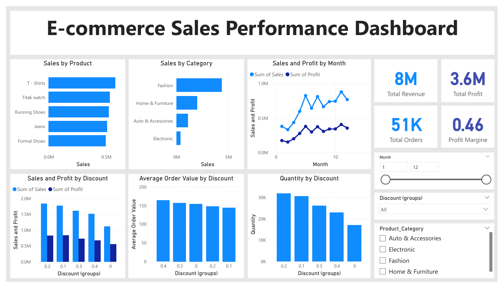
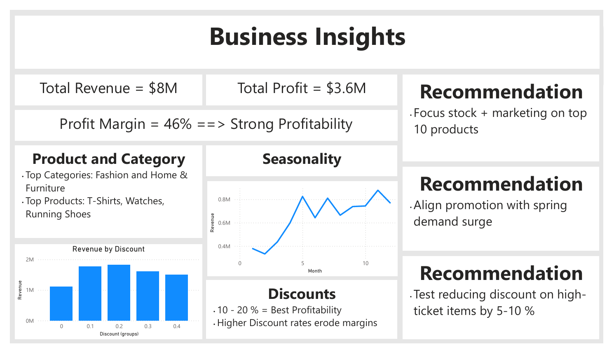

Project Summary: E-Commerce Sales Performance Dashboard
Problem Statement
Management wants to understand overall sales performance, which products and categories drive the most revenue, whether sales vary by season or region, and if offering discounts improves or hurts profit margins.
This breaks down into:
1. How much total revenue, profit, and number of orders did we make?  
2. Which products and categories are the top performers?  
3. Do sales increase or decrease in certain months or seasons?  
4. Do discounts help us make more money, or do they reduce profit margins?

KPI blueprint
Core Profitability KPIs:
•	Total Profit = SUM(Profit column)
•	Profit Margin % = Profit ÷ Revenue
•	Profit per Order = Profit ÷ Number of Orders
•	Top Products by Profit
•	Top Categories by Profit
Supporting Revenue/Volume KPIs:
•	Total Revenue = SUM(Sales)
•	Number of Orders
•	Average Order Value (AOV) = Revenue ÷ Orders
•	Revenue Trend by Month/Quarter
•	Regional Revenue & Profit Comparison
Discount Analysis (A/B Testing KPIs):
•	Discounted Revenue vs Non-Discounted Revenue
•	Discounted Profit vs Non-Discounted Profit
•	Profit Margin Difference between the two groups
🔹 Data Source and Format
•	Dataset: E-Commerce Transactions Dataset from Kaggle (Carrie1’s dataset).
•	Format: CSV file, containing transaction-level records with fields such as:
Order_Date, Time, Customer_ID, Gender, Device_Type, Product_Category, Product, Sales, Quantity, Discount, Profit, Shipping_Cost, Region, Payment_Method.
•	The dataset includes both quantitative fields (Sales, Profit, Quantity, Discount) and categorical fields (Region, Product Category, Customer attributes).

🔹 Key Findings and Business Recommendations
1.	Strong Profitability
o	2018 Revenue: ≈ 8M
o	Profit: ≈ 3.6M (≈ 46% margin, very healthy).
o	Recommendation: Maintain operational efficiency while exploring areas for scaling product sales.
2.	Product & Category Insights
o	Top performers: Fashion and Home & Furniture categories; top products include T-shirts, watches, and running shoes.
o	Electronics and Auto Accessories underperform significantly.
o	Recommendation: Increase marketing focus and stock planning for high-demand products, while running targeted promotions or bundles for weaker categories.
3.	Seasonality & Demand Trends
o	Sales dip in January–February (post-holiday slump), then rise steadily from March through May.
o	Recommendation: Plan discount campaigns in Q1 to stimulate demand and stock up in late Q2 for growth.
4.	Discount Insights
o	10–20% discounts generated the highest revenue and profit.
o	30–40% discounts are mostly used for expensive items but yield lower total revenue and reduce margins.
o	Recommendation: Focus discounts in the 10–20% range for volume products. Test reducing discounts on high-ticket items to improve margins without hurting sales volume.

🔹 Technologies Used
•	Power BI Desktop: for data modelling, visualization, and dashboard design.
•	Power Query: for data cleaning and transformation.
•	DAX (Data Analysis Expressions): for calculated measures (Revenue, Profit, AOV, Profit Margin %, Discounted vs Non-Discounted sales).
•	Excel/CSV: as the raw input data source.
•	Power BI Maps & Line Charts: for regional insights and time trend analysis.
